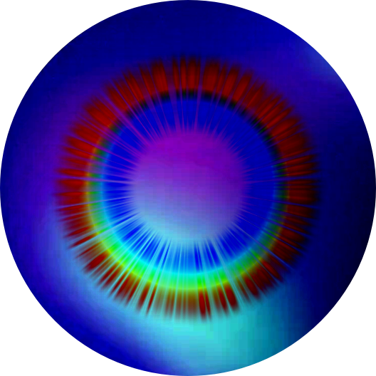

<div align="center">

# Authentic Not

Online art exhibition space

<br>
<picture>
    
</picture>

</div>

## Exhibition engine

Each file in `src/scenes/` owns that scene's objects, lights, modal content, sounds,
fog, animations, and interaction callbacks. Scenes import manager singletons
directly and can combine them freely:

```ts
wireInteractive(object, () => {
    audioManager.play("click");
    subtitleManager.show("Selected artwork", 1600);
    modalManager.open(artworkModal);
});
```

`sceneManager` only registers, loads, unloads, and switches scenes. On a switch it
clears all scene-scoped resources before loading the next scene.

Available managers:

- `cameraManager`
- `highlightManager`
- `lightManager`
- `modalManager`
- `animationManager`
- `audioManager`
- `subtitleManager`
- `fogManager`
- `sceneManager`

Run locally with `pnpm dev`, or create a production build with `pnpm build`.
