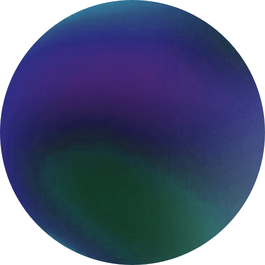

# Authentic Not

Interactive online curatorial and research art exhibition

 
<picture>
    
</picture>

## Terms of Use & Copyright

All artworks presented within Authentic-not remain the intellectual property of their respective artists. Unless explicitly stated otherwise, all rights to individual artworks, including digital artworks, videos, images, sound works, 3D objects and other artistic content, are reserved by their respective copyright holders. The public accessibility of an artwork through Authentic-not does not constitute permission or a licence to reproduce, download for further use, publish, distribute, modify, commercially exploit or otherwise use the artwork.

## Exhibition engine

Each file in `src/scenes/` takes care of that scene's objects, lights, modal content, sounds, fog, animations, and interaction callbacks. Scenes import manager singletons directly and can combine them freely. `sceneManager` only registers, loads, unloads, and switches scenes. On a switch it clears all scene-scoped resources before loading the next scene.

Available managers:

- `animationManager` — add mesh motion animation from presets
- `audioManager` — load and play sounds
- `backgroundManager` — add HDR or `.env` environment map skybox
- `cameraManager` — default camera setup and can switch walk/orbit type
- `fogManager` — optional scene distance fog or particle mist
- `highlightManager` — pointer hover handlers and mesh highlight styles
- `lightManager` — default hemi ligth and optional spot lights
- `modalManager` — handles full-screen overlay windows with custom content
- `objectManager` — creates scene objects from GLB files, images or videos
- `sceneManager` — register scenes, switch via URL hash, and clear resources
- `subtitleManager` — displays short on-screen captions

Run locally with `pnpm dev`, or create a production build with `pnpm build`.
